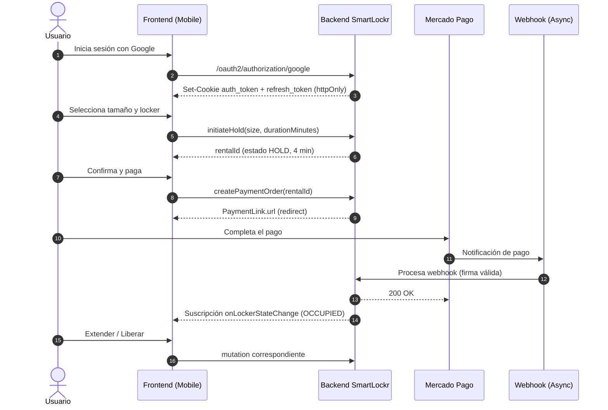
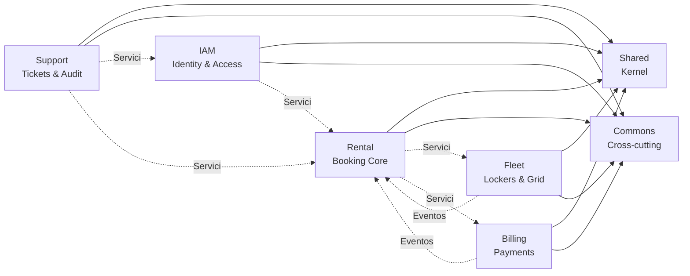

# SmartLockr Backend Core


> **Repositorio Oficial del Backend**
> Plataforma para el alquiler digital de lockers urbanos inteligentes.
> Arquitectura: **Monolito Modular** con **Domain-Driven Design (DDD)** y estilo **Hexagonal (Ports & Adapters)**.

---

## Visión del Producto

**SmartLockr** transforma el concepto tradicional de lockers urbanos en un servicio digital, inteligente y completamente automatizado, gestionado desde la palma de la mano. La plataforma elimina llaves físicas y operación manual, ofreciendo almacenamiento temporal seguro, flexible y accesible al instante.

### Objetivos Clave (OKRs)

| Objetivo | Resultado Clave |
|---|---|
| Lanzar un MVP robusto | 100% del flujo de alquiler funcional (búsqueda → reserva → pago → uso → liberación) |
| Lanzar un MVP robusto | Tasa de éxito de pagos en Mercado Pago ≥ 95% |
| Experiencia Superior | Tiempo desde selección de tamaño hasta pasarela de pago < 30 s |
| Experiencia Superior | Tasa de abandono de reserva < 15% |
| Experiencia Superior | Tickets de soporte < 1% de transacciones completadas |
| Operación Eficiente | 0% de dependencia de personal físico en sitio |
| Operación Eficiente | Un único administrador gestiona la flota completa desde el panel |

---

## Actores y Experiencias

El sistema define tres actores con experiencias diferenciadas.

### 1. Visitante (no autenticado)

- Visualiza una pantalla de bienvenida con la propuesta de valor.
- Único método de acceso: botón **Iniciar sesión con Google**.

### 2. Consumidor (autenticado)

| Código | Capacidad |
|---|---|
| FR-C1 | Autenticación vía **Google OAuth2** con sesión gestionada en cookies `httpOnly` |
| FR-C2 | Onboarding de una sola pantalla tras el primer login |
| FR-C3 | Navegación contextual: si tiene alquiler activo, va a su gestión; si no, a la grilla |
| FR-C4 | Selección de tamaño y visualización de grilla en tiempo real |
| FR-C5 | Reserva temporal **HOLD** de 4 minutos durante el pago |
| FR-C6 | Pago mediante redirección a **Mercado Pago** y confirmación por **webhook** |
| FR-C7 | Panel "Mis Lockers" con acciones para añadir tiempo y liberar |
| FR-C8 | Pago de penalización por expiración mediante flujo dedicado |
| FR-C9 | Creación de ticket de soporte desde la vista de una reserva activa |
| FR-C10 | Ajustes de cuenta (nombre, recibos y promociones) |

### 3. Administrador

| Código | Capacidad |
|---|---|
| FR-A1 | Acceso seguro mediante Google OAuth2 desde URL dedicada |
| FR-A2 | Vista operativa con flota, estado del servicio y configuración vigente |
| FR-A3 | Consulta de flota de lockers y cambio de estado |
| FR-A4 | Configuración dinámica de reglas de negocio (tarifas, penalizaciones) |
| FR-A5 | Cambio del estado global del servicio |
| FR-A6 | Gestión y respuesta de tickets de soporte |

---

## Casos de Uso Clave



---

## Arquitectura y Bounded Contexts

El sistema se organiza como **monolito modular**: cada contexto es un módulo cohesivo con su propio dominio, comunicándose con los demás mediante interfaces de servicio o eventos asíncronos (RabbitMQ).



| Contexto | Responsabilidad |
|---|---|
| **IAM** | Usuarios, autenticación OAuth2, JWT, hashing, refresh tokens |
| **Fleet** | Inventario físico, máquina de estados del locker, grilla, tarifas, configuración de negocio |
| **Rental** | Motor de reservas (HOLD/OCCUPIED), expiraciones con Redis, extensiones, penalizaciones |
| **Billing** | Integración con Mercado Pago, validación de firma de webhooks, cálculo de precios |
| **Support** | Tickets de soporte y registro interno de auditoría |
| **Shared** | Kernel común: configuración, excepciones, i18n, email, utils, scheduling |
| **Commons** | Anotaciones transversales (ej. `@GraphQLController`) y utilidades reutilizables |

---

## Estructura del Proyecto

Cada Bounded Context sigue arquitectura **Hexagonal (Ports & Adapters)**:

- `application` → casos de uso, servicios de dominio, mappers, excepciones de negocio.
- `infrastructure` → adaptadores técnicos: resolvers GraphQL, controllers REST, repositorios JPA, consumidores/producers de RabbitMQ.

```bash
src/main/java/com/smartlockr
├── commons                    # Anotaciones y utilidades transversales
│
├── shared                     # Kernel común del sistema
│   ├── config                 # Configuración global
│   ├── email                  # Servicios y plantillas de email
│   ├── exception              # Manejo de errores compartido
│   ├── i18n                   # Internacionalización
│   ├── infrastructure         # Adaptadores compartidos
│   ├── messaging              # Configuración y contratos de mensajería
│   ├── properties             # Propiedades tipadas
│   └── utils                  # Utilidades compartidas
│
├── iam                        # Contexto: Identidad y Acceso
│   ├── application            # UserService, mappers, DTOs, excepciones
│   └── infrastructure         # Security config, OAuth2 handlers, JWT adapter, repositorios
│
├── fleet                      # Contexto: Flota de Lockers
│   ├── application            # FleetService, BusinessService, mappers, eventos
│   └── infrastructure         # GraphQL resolvers (consumer + admin), repositorios JPA
│
├── rental                     # Contexto: Alquileres
│   ├── application            # RentalService, mappers, excepciones
│   └── infrastructure         # Resolvers GraphQL, listeners Redis, scheduling, snapshots
│
├── billing                    # Contexto: Facturación
│   ├── application            # BillingService, PricingService, validadores, mappers
│   └── infrastructure         # Webhook controller, cliente HTTP Mercado Pago, messaging
│
└── support                    # Contexto: Soporte
    ├── application            # SupportService, DTOs, mappers
    └── infrastructure         # Resolvers GraphQL (user + admin), repositorios
```

---

## Stack Tecnológico

| Categoría | Tecnología | Versión |
|---|---|---|
| Lenguaje | Java (OpenJDK) | 25 |
| Framework | Spring Boot | 3.5.14 |
| Build | Maven + Temurin JDK | 3.9.12 / 25 |
| Persistencia | PostgreSQL | 18 |
| Caché y Locks | Redis | 8.4-alpine |
| Mensajería | RabbitMQ | 3.13-management |
| ORM | Spring Data JPA + Hibernate | — |
| Migraciones | Flyway | Gestionado por Spring Boot |
| API de Negocio | Spring GraphQL | — |
| Realtime | Spring WebSocket (subscriptions) | — |
| Auth | Spring Security 6 + OAuth2 Client (Google) | — |
| Tokens | JJWT (HS512) | 0.13.0 |
| Pagos | Mercado Pago SDK Java | 2.9.2 |
| Email | Spring Mail (SMTP) | — |
| Mapping | MapStruct + Lombok | 1.7.0 / 1.18.42 |
| Validación | Jakarta Bean Validation | — |
| Monitoreo | Spring Actuator + Micrometer | — |
| Métricas | Prometheus | v3.8.1 |
| Visualización | Grafana | 12.2.0 |
| Calidad | SonarQube + JaCoCo (umbral ≥ 55%) | — |
| Tests | JUnit 5 + Mockito + Testcontainers + Spring GraphQL Test | — |

---

## Requisitos Previos

El proyecto adopta una estrategia **Container-First**: la compilación y ejecución
ocurren dentro de los contenedores mediante un `Dockerfile` multistage. Para
levantar la aplicación con Docker no se requiere Java ni Maven en el host. Para
ejecutar tests o comandos Maven fuera de Docker, usar JDK 25 y el Maven Wrapper.

### Instalación obligatoria

- **Docker Desktop** (con `compose` integrado).
  - [Descargar Docker Desktop](https://www.docker.com/products/docker-desktop/)

### Verificación del sistema

- **Windows:** WSL 2 activado.
- **Linux:** `docker-ce` y `docker-compose-plugin`.
- **macOS:** Docker Desktop para Apple Silicon / Intel.

```bash
docker compose version
```

---

## Configuración (`vars.env` y `vars_docker.env`)

Crear `vars.env` para ejecución local y `vars_docker.env` para Docker. El
archivo `compose.yml` consume `vars_docker.env` en el contenedor backend.

```properties
# =========================================================
# SMARTLOCKR CONFIG (vars.env)
# =========================================================

SPRING_PROFILES_ACTIVE=dev

# ---- DATABASE ----
DATABASE_URL=jdbc:postgresql://localhost:5432/santasoft
DATABASE_USER=postgres
DATABASE_PASSWORD=your_database_password

# ---- FLYWAY ----
# Usar true una sola vez para adoptar una base existente creada por Hibernate.
SPRING_FLYWAY_BASELINE_ON_MIGRATE=false

# ---- SECURITY (Google OAuth2) ----
GOOGLE_CLIENT_ID=your_google_client_id
GOOGLE_CLIENT_SECRET=your_google_client_secret
OAUTH_REDIRECT_URI=http://localhost:3000/home

# ---- SECURITY (JWT - HS512) ----
JWT_EXPIRATION_TIME=30m
JWT_AUDIENCE=smartlockr-app
JWT_ISSUER=santasoft-api
# Generar: openssl rand 64 | base64 | tr -d '\n'
JWT_SECRET_KEY=TU_CLAVE_SECRETA_BASE64_SUPER_LARGA_AQUI
REFRESHTOKEN_BYTE_SIZE=64
REFRESHTOKEN_EXPIRATION_TIME=7d
ADMIN_EMAIL=admin@smartlockr.com
SECURITY_CSRF_ENABLED=true

# ---- COOKIES ----
COOKIES_SECURE=false
# Valores permitidos:
# - lax:  Recomendado para navegación estándar.
# - strict: Bloquea cookies en navegación cross-site.
# - none:  Requiere Secure=true, para contextos de terceros.
COOKIES_SAMESITE=lax

# ---- MERCADO PAGO ----
MERCADOPAGO_ACCESS_TOKEN=APP_USR-12345678-1234..
MERCADOPAGO_WEBHOOK_SECRET=webhook_secret_from_seller_account
MERCADOPAGO_WEBHOOK_URL=https://your-ngrok-url/api/v1/webhooks/mercadopago
MERCADOPAGO_BACK_URL_SUCCESS=http://localhost:3000/payment/success
MERCADOPAGO_BACK_URL_FAILURE=http://localhost:3000/payment/failure

# ---- EMAIL (SMTP) ----
EMAIL_ENABLED=false
EMAIL_FROM=no-reply@smartlockr.com
EMAIL_SUPPORT_ADDRESS=support@smartlockr.com
EMAIL_BRAND_NAME=SmartLockr
SMTP_HOST=smtp.gmail.com
SMTP_PORT=587
SMTP_USERNAME=no-reply@smartlockr.com
SMTP_PASSWORD=your_app_password
SMTP_AUTH=true
SMTP_STARTTLS_ENABLE=true

# ---- CORS ----
# Si es más de una ruta separadas por coma (Ej: http://localhost:3000,http://localhost:3001)
ALLOWED_ORIGINS=http://localhost:3000

# ---- REDIS ----
SPRING_DATA_REDIS_PASSWORD=create_your_redis_password_here
REDIS_HOST=localhost
REDIS_PORT=6379

# ---- RABBITMQ ----
RABBITMQ_HOST=localhost
RABBITMQ_PORT=5672
RABBITMQ_USERNAME=smartlockr
RABBITMQ_PASSWORD=smartlockr

# ---- DEV TOOLS ----
DEV_GRAPHIQL=true

# ---- BUSINESS SEED (Flyway) ----
BUSINESS_HOLD_DURATION_SECONDS=240
BUSINESS_MIN_RENTAL_DURATION_MINUTES=15
BUSINESS_MAX_RENTAL_DURATION_MINUTES=10800
BUSINESS_PENALTY_PERCENTAGE=50
BUSINESS_STREAK_DISCOUNT_PERCENTAGE=10
BUSINESS_STREAK_THRESHOLD=7
BUSINESS_RATE_XS=1600
BUSINESS_RATE_S=2300
BUSINESS_RATE_M=3800
BUSINESS_RATE_L=4900
BUSINESS_RATE_XL=6150
LOCKER_QUANTITY_XS=128
LOCKER_QUANTITY_S=80
LOCKER_QUANTITY_M=72
LOCKER_QUANTITY_L=64
LOCKER_QUANTITY_XL=0
```

> Para el contenedor backend, usar `REDIS_HOST=redis`,
> `RABBITMQ_HOST=rabbitmq`, y `DATABASE_URL` apuntando al servicio
> `postgres`.
> Si se cambian `RABBITMQ_USERNAME` o `RABBITMQ_PASSWORD`, declararlos
> también en el entorno de Docker Compose o en un archivo `.env`;
> `vars_docker.env` solo se inyecta en el backend.

---

## Instalación y Ejecución

`compose.yml` incluye `build: .`, lo que indica a Docker que compile la imagen desde el `Dockerfile` local antes de levantar los servicios.

### 1. Clonar el repositorio

```bash
git clone https://github.com/Santa-Softt/SmartLocker-Back.git
cd SmartLocker-Back
```

### 2. Configurar el entorno

Crear el archivo `vars.env` (y `vars_docker.env` si se ejecuta vía Docker) con las credenciales reales.

### 3. Levantar los servicios

**Modo interactivo (logs en consola):**

```bash
docker compose up
```

**Modo detached (segundo plano):**

```bash
docker compose up -d
```

### 4. Servicios expuestos

| Servicio | Puerto host | Descripción |
|---|---|---|
| Backend (API) | `8080` | GraphQL + REST + WebSocket |
| Actuator | `9090` | Health y métricas internas |
| PostgreSQL | `5432` | Base de datos principal |
| Redis | `6379` | Caché, locks y eventos de expiración |
| RabbitMQ AMQP | `5672` | Mensajería asíncrona |
| RabbitMQ Management | `15672` | Consola web de RabbitMQ |
| Prometheus | `9091` | UI de métricas; scrapea `/actuator/prometheus` del backend |
| Grafana | `3001` | Dashboards (admin/admin por defecto) |

### 5. Migraciones y datos iniciales

Flyway ejecuta las migraciones de `src/main/resources/db/migration` antes de
que Hibernate valide el modelo JPA. La migración inicial crea el schema con
UUIDv7 como valor por defecto y luego inserta el administrador, la configuración
de negocio y la flota inicial de **344 lockers**.

Para adoptar una base existente creada con `hibernate.ddl-auto`, ejecutar una
sola vez con:

```properties
SPRING_FLYWAY_BASELINE_ON_MIGRATE=true
```

Después de esa primera ejecución, volver a `false` para que Flyway mantenga un
historial estricto.

---

## Documentación API

### 1. API de Sesión (REST)

Encargada del flujo OAuth2 y la gestión de cookies `HttpOnly`.

| Método | Endpoint | Descripción |
|---|---|---|
| `GET`  | `/oauth2/authorization/google` | Redirige al proveedor de identidad (Google). |
| `GET`  | `/login/oauth2/code/google`     | Callback OAuth2; setea cookies y redirige al frontend. |
| `GET`  | `/auth/me`                      | Retorna información del usuario autenticado. |
| `POST` | `/auth/refresh`                 | Genera un nuevo Access Token usando la cookie de Refresh. |
| `POST` | `/auth/logout`                  | Invalida la sesión y elimina las cookies. |
| `POST` | `/api/v1/webhooks/mercadopago`  | Receptor de notificaciones de pago de Mercado Pago. |
| `POST` | `/api/v1/webhooks/mercadopago/none` | Receptor sin firma para desarrollo o pruebas. |

### 2. API de Negocio (GraphQL)

Interfaz para todas las operaciones de datos, consultas, mutaciones y suscripciones en tiempo real.
Consola interactiva disponible en `http://localhost:8080/graphiql` cuando el entorno habilita `DEV_GRAPHIQL=true`.

#### Ejemplo: Reservar Locker (Mutation)

```graphql
mutation {
  initiateHold(size: L, durationMinutes: 120) {
    rentalId
    locker { label size state }
    startTime
    estimatedEndTime
  }
}
```

#### Ejemplo: Consultar lockers disponibles (Query)

```graphql
query {
  getAvailableLockersBySize(size: M) {
    id
    label
    state
  }
}
```

#### Ejemplo: Suscripción a cambios de la grilla (WebSocket)

```graphql
subscription {
  onLockerStateChange {
    id
    state
  }
}
```

---

## Manejo de Errores

### REST (JSON)

Estructura estándar de Spring Boot para errores 4xx/5xx en endpoints REST.

```json
{
  "timestamp": "2025-09-21T10:00:00Z",
  "status": 401,
  "error": "Unauthorized",
  "message": "Full authentication is required to access this resource",
  "path": "/auth/me"
}
```

### GraphQL (Errors + Extensions)

Las reglas de negocio se exponen dentro del array `errors.extensions`.

```json
{
  "data": null,
  "errors": [
    {
      "message": "Locker occupied.",
      "path": ["initiateHold"],
      "extensions": {
        "errorType": "LOCKER_UNAVAILABLE",
        "classification": "BUSINESS_RULE_VIOLATION"
      }
    }
  ]
}
```

---

## Calidad y Observabilidad

### Calidad de código

- **SonarQube** — configurado en `sonar-project.properties`. Ejecutar:

  ```bash
  ./mvnw -B verify sonar:sonar -Dsonar.host.url=http://localhost:9000
  ```

- **JaCoCo** — informe de cobertura integrado al ciclo `mvn verify`.
  Umbral mínimo de línea cubierta: **55%** (configurable en `pom.xml`).

### Observabilidad

- **Spring Actuator** — endpoints en `http://localhost:9090/actuator`.
- **Prometheus** — UI disponible en `http://localhost:9091`; scrapea las métricas Micrometer del backend en `/actuator/prometheus`.
- **Grafana** — dashboards preconfigurados en `monitoring/grafana/dashboards`, disponibles en `http://localhost:3001` (credenciales por defecto `admin`/`admin`).
- **Health checks** — definidos en `compose.yml` para backend, postgres, redis y rabbitmq.

### Pruebas

- **Unitarias** — JUnit 5 + Mockito.
- **Integración** — Testcontainers (PostgreSQL con Flyway, RabbitMQ).
- **GraphQL** — `spring-graphql-test`.

```bash
./mvnw -B test              # suite de tests de Surefire
./mvnw -B verify            # Surefire + Failsafe + JaCoCo
```

---

## Versionado y Release

El versionado es **semántico** (`vMAJOR.MINOR.PATCH`) y se calcula automáticamente a partir de las etiquetas del PR:

| Etiqueta en PR | Efecto |
|---|---|
| `version:major` | Incrementa `MAJOR`, resetea `MINOR` y `PATCH` |
| `version:minor` | Incrementa `MINOR`, resetea `PATCH` |
| `version:patch` | Incrementa `PATCH` |

Flujo automatizado (`docker-push-and-version.yml`):

1. PR mergeado contra `main` o `develop`.
2. Workflow lee etiquetas y calcula la nueva versión.
3. Construye y publica la imagen Docker con el tag Git calculado por el workflow.
4. Crea y empuja el tag `vX.Y.Z` al repositorio.

### Imagen Docker

```bash
VERSION=$(git describe --tags --abbrev=0)
docker pull santasoft/smartlockr-back:${VERSION}
```

---

## Contribución

1. Crear una rama feature desde `develop`: `git checkout -b feature/<scope>-<short-desc>`.
2. Commits siguiendo **Conventional Commits** (`feat:`, `fix:`, `test:`, `refactor:`, `docs:`).
3. Asegurar que `./mvnw -B verify` pase localmente (incluye JaCoCo).
4. Abrir PR contra `develop` (o `main` para hotfixes) con:
   - Plantilla de PR (`.github/pull_request_template.md`).
   - Etiqueta de versionado (`version:major|minor|patch`) si corresponde.
5. El CI de GitHub Actions validará la build antes de mergear.

### Plantillas disponibles

- `.github/ISSUE_TEMPLATE/-feature--descripción-breve.md`
- `.github/ISSUE_TEMPLATE/descripción-breve-del-bug.md`
- `.github/pull_request_template.md`

---

## Licencia

Este repositorio **no incluye aún un archivo `LICENSE`**. Se recomienda agregar uno (por ejemplo, MIT o Apache-2.0) antes de cualquier distribución pública. Hasta entonces, todos los derechos están reservados por **SantaSoft Engineering**.

---

© 2026 SmartLockr · SantaSoft Engineering