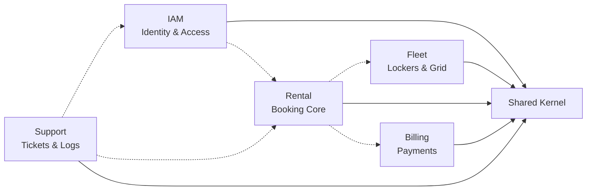

# 🔐 SmartLockr Backend Core


> **Repositorio Oficial del Backend**
> Sistema de gestión de lockers urbanos inteligentes.
> Arquitectura: **Monolito Modular** implementando **Domain-Driven Design (DDD)**.

---

## 🏙️ Visión del Producto

**SmartLockr** es una plataforma que digitaliza el alquiler de lockers urbanos, eliminando llaves físicas y gestión manual. El sistema da soporte a dos aplicaciones cliente:

### 1. Consumer App (Mobile-Only)
Permite a los usuarios finales:
*   Visualizar la disponibilidad de lockers en tiempo real.
*   Realizar reservas temporales (**HOLD**) de 2 minutos para asegurar el recurso antes del pago.
*   Gestionar el ciclo de vida del alquiler (Apertura, Extensión de tiempo, Liberación) y pagos vía **Mercado Pago**.

### 2. Admin Panel (Desktop-Only)
Permite a los operadores:
*   Gestionar el inventario físico (Lockers XS a XL) y sus estados (`AVAILABLE`, `MAINTENANCE`).
*   Configurar reglas de negocio (Tarifas, tiempos de penalización).
*   Auditar el sistema y gestionar tickets de soporte.

---

## 📋 Tabla de Contenidos

1. [Requisitos Previos (Docker)](#-requisitos-previos-docker)
2. [Arquitectura y Contextos](#-arquitectura-y-contextos)
3. [Estructura del Proyecto](#-estructura-del-proyecto)
4. [Stack Tecnológico](#-stack-tecnológico)
5. [Configuración (vars.env)](#-configuración-varsenv)
6. [Instalación y Ejecución](#-instalación-y-ejecución)
7. [Documentación API](#-documentación-api)
8. [Manejo de Errores](#-manejo-de-errores)

---

## 🐳 Requisitos Previos (Docker)

El proyecto utiliza una estrategia **Container-First**. La compilación y ejecución ocurren dentro de los contenedores mediante Docker Multistage. **No se requiere Java ni Maven en el host.**

### 1. Instalación Obligatoria
*   **Docker Desktop:** Es necesario para gestionar el motor de contenedores y `compose`.
    *   📥 **[Descargar Docker Desktop](https://www.docker.com/products/docker-desktop/)**

### 2. Verificación del Sistema
*   **Windows:** Requiere WSL 2 activado.
*   **Linux:** Requiere `docker-ce` y `docker-compose-plugin`.
*   **Comando de verificación:**
    ```bash
    docker compose version
    ```

---

## 🏛 Arquitectura y Contextos

La aplicación sigue una arquitectura de **Monolito Modular**. El código está dividido en **Bounded Contexts** que encapsulan dominios específicos, comunicándose entre sí mediante eventos o interfaces de servicio estrictas.



*   **IAM:** Gestión de usuarios, autenticación OAuth2 y roles.
*   **Fleet:** Gestión de activos físicos (lockers), hardware y grilla.
*   **Rental:** Motor de reservas, validación de disponibilidad y penalizaciones.
*   **Billing:** Integración con pasarela de pagos (Mercado Pago).
*   **Support:** Atención al cliente y logs de auditoría.

---

## 📂 Estructura del Proyecto

Se implementa una arquitectura hexagonal (Ports & Adapters) dentro de cada módulo.

*   **Application:** Lógica de negocio pura, casos de uso y servicios de dominio.
*   **Infrastructure:** Implementación técnica (Controladores, Repositorios JPA, Clientes Externos).

```bash
src/main/java/com/santasoft/smartlockr
├── shared                      # Kernel: Configuración global, Excepciones, Utils
│
├── iam                         # Contexto: Identidad
│   ├── application             # Servicios de Autenticación, Gestión de Sesión
│   └── infrastructure          # Auth Controllers, Spring Security Config, User Entity
│
├── fleet                       # Contexto: Flota
│   ├── application             # Lógica de Grilla, Máquina de Estados de Lockers
│   └── infrastructure          # GraphQL Resolvers, Locker Repository/Entity
│
├── rental                      # Contexto: Alquileres
│   ├── application             # Casos de Uso: Reservar, Extender, Penalizar
│   └── infrastructure          # GraphQL Resolvers, Rental Repository/Entity
│
├── billing                     # Contexto: Facturación
│   ├── application             # Lógica de cálculo de tarifas
│   └── infrastructure          # Cliente HTTP Mercado Pago, Webhook Controller
│
└── support                     # Contexto: Soporte
    ├── application             # Gestión de Tickets, Servicios de Auditoría
    └── infrastructure          # GraphQL Resolvers, System Log Repository
```

---

## 🛠 Stack Tecnológico

*   **Lenguaje:** Java 25
*   **Framework:** Spring Boot 3.5.7
*   **API Interface:**
    *   Spring GraphQL (Operaciones de Negocio & WebSockets)
    *   Spring MVC (OAuth2 Auth & Webhooks)
*   **Persistencia:**
    *   PostgreSQL 16 (Entorno Dockerizado)
    *   H2 Database (Entorno de Tests)
    *   Spring Data JPA
*   **Seguridad:** Spring Security 6, OAuth2 Client, JWT (HS512)

---

## ⚙ Configuración (vars.env)

Crea un archivo llamado `vars.env` en la raíz del proyecto. Estas variables son inyectadas en el contenedor al iniciar.

```properties
# =========================================================
# SMARTLOCKR CONFIG (vars.env)
# =========================================================

SPRING_PROFILES_ACTIVE=dev/prod

# ---- DATABASE ----
# Host 'postgres_db' es el nombre del servicio en docker-compose
DATABASE_URL=jdbc:postgresql://postgres:5432/santasoft
DATABASE_USER=postgres
DATABASE_PASSWORD=your_database_password

# ---- SECURITY (Google OAuth2) ----
GOOGLE_CLIENT_ID=your_google_client_id
GOOGLE_CLIENT_SECRET=your_google_client_secret
OAUTH_REDIRECT_URI=http://localhost:3000/home

# ---- SECURITY (JWT - HS512) ----
JWT_EXPIRATION_TIME=30m
JWT_ISSUER=santasoft-api
# Generar: openssl rand 64 | base64 | tr -d '\n'
JWT_SECRET_KEY=TU_CLAVE_SECRETA_BASE64_SUPER_LARGA_AQUI
REFRESHTOKEN_EXPIRATION_TIME=7d

# ---- COOKIES ----
COOKIES_SECURE=false
# Valores permitidos:
# - lax: Recomendado para navegación estándar.
# - strict: Bloquea cookies en navegación cross-site.
# - none: Requiere Secure=true, para contextos de terceros.
COOKIES_SAMESITE=lax

# ---- MERCADO PAGO ----
MERCADOPAGO_ACCESS_TOKEN=APP_USR-12345678-1234..
MERCADOPAGO_WEBHOOK_SECRET=webhook secret from seller account (don't use your main account webhook secret, it won't work)
MERCADOPAGO_WEBHOOK_URL=for development use cmd 'ngrok http 8080' link to proxy your backend requires to be the same url in mercadopago
MERCADOPAGO_BACK_URL_SUCCESS=http://localhost:3000/payment/success
MERCADOPAGO_BACK_URL_FAILURE=http://localhost:3000/payment/failure

# ---- EMAIL (SMTP) ----
MAIL_HOST=smtp.gmail.com
MAIL_PORT=587
MAIL_USERNAME=no-reply@smartlockr.com
MAIL_PASSWORD=your_app_password

# ---- CORS ----
# Si es más de una ruta separadas por coma (Ej: http:localhost:3000, http:localhost:3001)
ALLOWED_ORIGINS=http://localhost:3000

# ---- REDIS ----
SPRING_DATA_REDIS_PASSWORD=create your redis password here
REDIS_HOST=localhost or redis if using Docker
REDIS_PORT=6379
```

---

## 🚀 Instalación y Ejecución

El archivo `docker-compose.yml` incluye la configuración `build: .`, lo que indica a Docker que debe construir la imagen utilizando el `Dockerfile` local antes de levantar los servicios.

### 1. Clonar el repositorio
```bash
git clone https://github.com/Santa-Softt/SmartLocker-Back.git
cd Smartlocker-Back
```

### 2. Configurar Entorno
Asegurarse de crear el archivo `vars.env` con las credenciales correspondientes.

### 3. Ejecutar
Para compilar la aplicación, crear la imagen y levantar los contenedores (App + DB):

**Modo Interactivo (Logs en consola):**
```bash
docker compose up
```

**Modo Detached (Segundo plano):**
```bash
docker compose up -d
```

> **Nota:** Al iniciar, la aplicación ejecuta un proceso de **Data Seeding**. Si la base de datos está vacía, se crearán automáticamente los usuarios administradores y la flota de **88 lockers** iniciales.

---

## 📖 Documentación API

### 1. API de Sesión (REST)
Endpoints encargados del flujo OAuth2 y gestión de cookies `HttpOnly`.

| Método | Endpoint                       | Descripción                                                     |
|:-------|:-------------------------------|:----------------------------------------------------------------|
| `GET`  | `/oauth2/authorization/google` | Redirige al proveedor de identidad (Google).                    |
| `GET`  | `/auth/me`                     | Retorna información del usuario y estado de la sesión.          |
| `POST` | `/auth/refresh`                | Genera un nuevo Access Token usando la cookie de Refresh Token. |
| `POST` | `/auth/logout`                 | Invalida la sesión y elimina las cookies del navegador.         |

### 2. API de Negocio (GraphQL)
Interfaz para todas las operaciones de datos y tiempo real.
Consola disponible en: `http://localhost:8080/graphiql`

#### Ejemplo: Reservar Locker (Mutation)
```graphql
mutation {
  initiateHold(size: L, durationMinutes: 120) {
    rentalId
    locker { label, size }
    startTime
    estimatedEndTime
  }
}
```

#### Ejemplo: Suscripción a Grilla (WebSockets)
```graphql
subscription {
  onLockerStateChange {
    id
    state # Updates: AVAILABLE -> HOLD -> OCCUPIED
  }
}
```

---

## ⚠️ Manejo de Errores

### REST Error (JSON)
Estructura estándar de Spring Boot para errores HTTP 4xx/5xx en endpoints REST.
```json
{
  "timestamp": "2025-09-21T10:00:00Z",
  "status": 401,
  "error": "Unauthorized",
  "message": "Full authentication is required to access this resource",
  "path": "/auth/me"
}
```

### GraphQL Error (Extensions)
Errores de validación o lógica de negocio dentro del array `errors`.
```json
{
  "data": null,
  "errors": [
    {
      "message": "Locker occupied.",
      "path": ["initiateHold"],
      "extensions": {
        "errorType": "LOCKER_UNAVAILABLE",
        "classification": "BUSINESS_RULE_VIOLATION"
      }
    }
  ]
}
```
---

© 2026 SmartLockr | SantaSoft Engineering.
